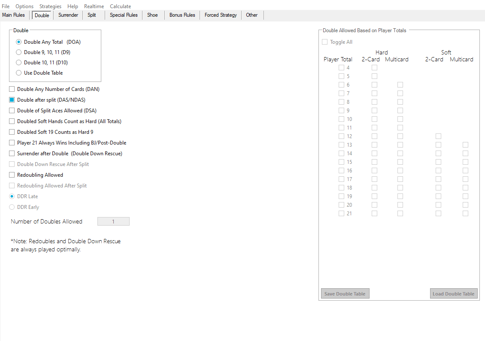
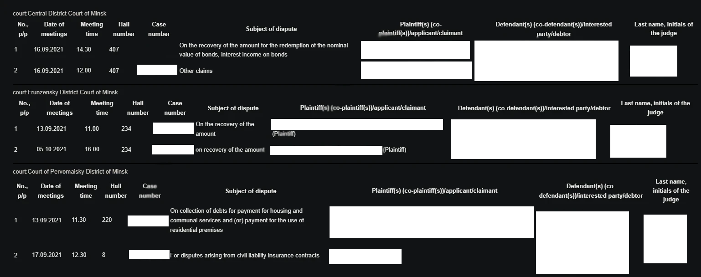

# 👋 Ilya — Backend & IoT Engineer

[Русский](./README.md)

**Backend & Embedded** engineer with **5+ years of experience**.
I design and deliver **end-to-end solutions**: from COM/Serial agents and embedded Linux devices (Raspberry/Orange Pi) to scalable backends on Python/Django/FastAPI.
Experience in production operation of device fleets (30–50+ units), real-time telemetry, secure WebSocket channels and containerized deployments (Docker). All projects are delivered to clients and **running in production**.

---

## 🔭 Brief

I design and deliver **end-to-end IoT and backend solutions**: from low-level device communication (COM / SAS / ADB) to scalable Docker-backends and user-friendly admin panels. All projects in the portfolio were delivered to clients and **are running in production**.

---

## 🎯 Technologies

Python · Django · FastAPI · Flask · WebSockets · Docker · Docker Compose · MSSQL · PostgreSQL · MySQL · SQLite · Redis · Git · GitHub Actions · GitLab CI · JavaScript · jQuery · Linux · Debian · Ubuntu · Bash · systemd · Nginx · Pandas · NumPy · Selenium · cron · ETL · Data pipelines · Data scraping · REST API · AsyncIO · IoT · Embedded Linux · Raspberry Pi · Orange Pi · ADB · Serial · SAS protocol · Device telemetry · Remote device management · Secure WebSocket channels · TLS/SSL · JWT · OAuth2 · Logging · Monitoring

---

## ⭐ Key projects

> *Only the SAS communication module (Project 3) and the client part of Project 2 are public in this repository. The server part of Project 2 and the other projects are proprietary client work and closed under NDA, but all are in active production. Where possible — demo videos and screenshots are attached.*

# 1) Metro TV — remote control and advertising management on TVs

## Short description

A platform for centralized management of Android TVs installed in the metro: allows remote control of devices, uploading and updating advertising campaigns, monitoring status and automating maintenance — all via a single web panel.

## Key features

* Full set of operations equivalent to a physical remote: power on/off (relay), source selection, volume control, playback control and keypress emulation.
* Real-time telemetry: TV power status, client status, Ethernet status, selected source, current output source, volume level.
* Secure bidirectional communication: encrypted and authenticated WebSocket channels between server and agents.
* Screen preview and on-demand screenshots: the interface shows what is currently displayed on the device screen.
* Maintenance tools: remote agent restart, log viewing, push updates and automatic recovery of malfunctioning clients.
* Visual card editor: a flexible editor in the web app that allows building “cards” with data fields and action triggers for each TV unit.
* Scalability: the system handles 150+ remote operations, system response time < 1.5s (request -> command execution on device -> update in the web application), with >= 47 devices in active operation.

## Business impact

* Deployment across many branches (metro stations) replaced manual, labor-intensive processes (technician trips) with remote management — saving dozens of hours and significantly reducing operating costs.
* Support for updates and debugging in near-real time improved campaign uptime and increased reliability for advertisers.

**[More about this project is available in my repository](https://github.com/mdedz/Metro-TV)**

---

# 2) Casino Clubs Administration System

## Short

Server and device fleet for collecting, decoding and displaying in real time telemetry and transactions from offline slot machines. The system is installed in multiple casino branches and converts raw COM-packets (SAS protocol) into understandable business events for operators and finance teams.

## Key features

* Capture and decode slot machine messages over COM port (SAS protocol) in real time.
* End-to-end pipeline: agent → WebSocket → Django server → MSSQL processing → admin panel.
* Live dashboards: transaction logs per machine, wins/losses, total insertions, player-machine binding and current session.
* Operational tools: device health monitoring, reconciliation reports, event alerts and historical analytics.
* Reliable operation in isolated (air-gapped) environments.
* > >= 36 machines in operation, response time <1s (request -> information retrieval -> update in the web application).

## Business impact

Automation and centralization of reconciliation replaced manual, error-prone procedures — reducing audit time, improving revenue transparency and enabling rapid detection and response to anomalies.

**[More about this project is available in my repository](https://github.com/mdedz/Casino-Administration)**

**[Client part](https://github.com/mdedz/SASCollectorService)**

---

# 3) SAS Communication Module

## Description

* Full support for the SAS protocol for slot machines (command types R, S, M, G are supported).
* Uses the `2F` command to start receiving data, extracts payload and saves it into an internal MSSQL database.
* Synchronizes data from the internal DB to an external MSSQL instance used by the public panel.
* Provides a listeners system: persistent listeners, one-time listeners, JSON-configurable command sets and a `Commands` class for programmatic use.
* Robust connection handling: retries, reconnection logic and error handling.
* Includes a DB connection module and support for custom jackpot/command handlers.
* Implemented in Python and `Serial`.

**[More about this project is available in my repository](https://github.com/mdedz/sas_comm_py)**

---

# 4) Old Analyzer — combinatorial analysis tool (restructuring)

**Role:** implementation and maintenance (VB.NET)

**What it does**

* Desktop analytical tool implementing combinatorial algorithms to enumerate and evaluate possible combinations.
* Delivered to the client and currently maintained in production.

---

# 5) Belarusian Courts Scraper + email notifications

## What it does

* Scrapes case lists from the Belarusian court website, which lacks search by plaintiff/defendant.
* Extracts relevant case data and automatically sends digests to a configured e-mail.
* Deployed and used by a client.

---

## 📸 Media

### Old Analyzer

### Courts scraper

---

## 🔐 Public / private policy

* **Public:** SAS module, client part of the Casino project.
* **Private:** project source code (under NDA).

---
