# 👋 Илья — Backend & IoT инженер

Инженер backend и встроенных систем, ориентированный на продакшн: проектирую, строю, разворачиваю и эксплуатирую распределённые бэкенды и парки устройств. **Более 5 лет ежедневной практической работы** с Python (Django / FastAPI / Flask), реальным временем (WebSockets / SAS / Serial / COM), контейнерными развёртываниями (Docker), встраиваемыми Linux‑устройствами (Raspberry/Orange Pi) и сопутствующими технологиями.

---

## 🔭 Кратко

Я проектирую и поставляю **end‑to‑end IoT и backend‑решения**: от низкоуровневой связи с устройствами (COM / SAS / ADB) до масштабируемых Docker‑бэкендов и удобных административных панелей. Все проекты из портфолио были внедрены заказчикам и **работают в продакшне**.

---

## ⭐ Основные проекты

> *В данном репозитории публичен только модуль связи SAS (Проект 4) и Клиентская часть Проекта 2. Серверная часть Проекта 2 и остальные проекты — проприетарные разработки для клиентов и закрыты по NDA, но все они в боевой эксплуатации. Где возможно — приложены демо‑видео и скриншоты.*

### 1) Metro TV — удалённое управление и управление рекламой (производство)

**Краткое описание**

Платформа для централизованного управления Android‑телевизорами, установленными в метро: позволяет удалённо контролировать устройства, загружать и обновлять рекламные кампании, мониторить состояние и автоматизировать обслуживание — всё через единую веб‑панель.

**Моя роль**

Я — единственный инженер проекта: полная ответственность за архитектуру системы, агент на устройствах и драйверы, серверную часть, веб‑интерфейс, автоматизацию развёртывания, безопасность и поддержку в продакшне. Я написал каждую строку кода клиентского агента и серверных компонентов.

**Ключевые возможности**

* Полный набор операций, эквивалентный физическому пульту: включение/выключение (relay), выбор источника, регулировка громкости, управление воспроизведением и эмуляция нажатий клавиш.
* Телеметрия в реальном времени: состояние питания ТВ, состояние клиента, статус Ethernet, выбранный источник, текущий источник вывода, уровень громкости.
* Безопасная двунаправленная связь: зашифрованные и аутентифицированные WebSocket‑каналы между сервером и агентами.
* Превью экрана и скриншоты по запросу: в интерфейсе отображается то же самое, что видно на экране устройства.
* Инструменты обслуживания: удалённый перезапуск агента, просмотр логов, пуш‑обновления и автоматическое восстановление некорректных клиентов.
* Визуальный редактор карточек: гибкий редактор в веб‑приложении, позволяющий строить «карточки» с полями данных и триггерами действий для каждой ТВ‑единицы.
* Масштабируемость: система справляется с выполнением 150+ удалённых операций, сохраняя отзывчивость и надёжность.

**Архитектура (высокоуровнево)**

* **Устройства:** Orange Pi с встраиваемым Linux; Python‑сервис (systemd) запускается внутри Docker. Агент устанавливает WebSocket‑клиент к серверу, взаимодействует с ТВ по ADB через Ethernet, управляет GPIO (реле) для питания и обеспечивает операции: скриншоты, управление громкостью, проверку сети и т.п.
* **Канал управления ТВ:** Android Debug Bridge (ADB) по Ethernet — Orange Pi подключается напрямую к ТВ и выполняет ADB‑команды для эмуляции кнопок и опроса состояния.
* **Сервер:** Django‑приложение с пользовательским интерфейсом, REST‑эндпоинтами и событийным WebSocket‑слоем. Redis используется для pub/sub и координации сессий; бэкенд контейнеризирован для воспроизводимого развёртывания.
* **Безопасность и транспорт:** TLS + прикладная аутентификация для WebSocket; валидация команд и ACL для действий пользователей. Все сообщения между устройством и сервером подписываются/шифруются и проверяются перед выполнением.

**Агент на устройстве — технологии и обязанности**

* Язык: Python под Linux внутри Docker.
* Связь: устойчивый WebSocket‑клиент с reconnect, heartbeat и подтверждением команд.
* Локальное управление ТВ: обёртка над ADB для эмуляции нажатий и опроса состояния устройства.
* Аппаратный ввод/вывод: биндинги `lgpio` для управления реле и дополнительные модули для захвата скриншотов, управления громкостью и проверки сети.
* Надёжность: watchdog‑поведение, корректные обработчики завершения, админ‑API для удалённых перезапусков и health‑probe.

**Cтруктура клиентской части**

```text
├── api
│   ├── api_logic.py
│   ├── configs
│   │   ├── api_response.py
│   │   ├── config.py
│   │   ├── exceptions.py
│   │   ├── global_vars.py
│   │   └── status.py
│   ├── decorators.py
│   ├── __init__.py
│   ├── shared.py
│   └── utils.py
├── device
│   ├── adb
│   │   ├── actions.py
│   │   └── __init__.py
│   ├── __init__.py
│   └── utils
│       ├── gpio.py
│       ├── __init__.py
│       ├── network.py
│       ├── screenshot.py
│       └── volume.py
├── docker-compose.yml
├── dockerfile
├── entrypoint.sh
├── INFO.md
├── README.md
├── requirements.txt
├── utils
│   ├── metro.service
│   ├── metro-shared.service
│   └── shared_check.sh
```

**Стек сервера и веб‑приложения**

* Backend: `Django`, Django REST Framework, WebSockets (channels‑style), Redis для pub/sub и координации состояния. Так же есть старая версия клиентской части с Flask, в последних версиях я использую WebSockets. 
* Frontend / админка: современный адаптивный интерфейс с визуальным редактором карточек (частично на jQuery). Whitenoise используется для подачи статических файлов в Docker‑контейнерах.
* Развёртывание: Docker / docker‑compose для локальной и дев‑сборки, специальные скрипты + systemd‑юниты для продакшн‑устройств.

**Надёжность, безопасность и эксплуатация**

* Все сообщения между устройствами и сервером зашифрованы и аутентифицированы; команды валидаются на стороне клиента и сервера.
* Автоматические health‑checks и удалённый перезапуск сокращают необходимость выездного обслуживания. При некорректной работе сервер может инициировать контролируемый рестарт агента или запуск watchdog‑цикла.
* Детальное логирование и снимки состояния (скриншоты, консоль) ускоряют диагностику инцидентов.
* Система спроектирована для минимизации простоя в условиях высокой нагрузки и нестабильных сетей.

**Бизнес‑эффект**

* Внедрение по многим веткам (станциям метро) заменило ручной, трудоёмкий процесс (выезды техников) на удалённое управление — экономия десятков часов и существенное снижение операционных расходов.
* Поддержка обновлений и отладки в режиме близком к реальному времени улучшила время доступности рекламных кампаний и повысила надёжность сервиса для рекламодателей.

**Почему проект выделяется**

* Энд‑ту‑энд владение: от низкоуровневых агентов (ADB, GPIO, Linux) до масштабируемого серверного слоя.
* Проект «боеготов»: надёжная связь, безопасность по умолчанию и понятный интерфейс для операторов без технического бэкграунда.
* Инженерный фокус на бизнес‑результате: сокращение OPEX и улучшение SLA для клиента.

**Весь код клиентской и серверной частей этого проекта написан и поддерживался мной.**

---

# 2) Веб‑приложение для управления казино — продакшн

## Кратко

Сервер и парк устройств для сбора, декодирования и отображения в реальном времени телеметрии и транзакций с оффлайн‑игровых автоматов. Система установлена в нескольких филиалах казино и переводит сырые COM‑пакеты (протокол SAS) в понятные бизнес‑события для операторов и финансовых команд.

## Моя роль

Я — единственный инженер: полная ответственность за архитектуру, агент на устройстве (Orange Pi), низкоуровневый парсер SAS, серверную часть, логику обработки данных, веб‑админку и развёртывание/поддержку в продакшне. Я реализовал обработчик COM, написал препроцессоры для MSSQL и опубликовал serial/SAS‑хендлер как публичный Python‑пакет для упрощения интеграций.

## Ключевые возможности

* Захват и декодирование сообщений игрового автомата по COM‑порту (протокол SAS) в реальном времени.
* Сквозной конвейер: агент → WebSocket → Django‑сервер → MSSQL‑обработка → админ‑панель.
* Live‑дашборды: логи транзакций по каждому автомату, выигрыши/проигрыши, суммарные внесения, привязка игрок‑автомат и текущая сессия.
* Инструменты для эксплуатации: мониторинг состояния устройств, сверочные отчёты, оповещения о событиях и историческая аналитика.
* Надёжная работа в изолированных (air‑gapped) средах.

## Архитектура (сжато)

* **Уровень устройства:** Orange Pi с Python‑агентом (systemd), чтение COM‑портов через `pyserial`, парсинг SAS‑фреймов и пересылка структурированных событий по постоянным WebSocket‑сессиям. Модули обрабатывают CRC, буферизацию и временное хранение.
* **Транспорт:** WebSocket‑сообщения для низкой задержки и двунаправленного потока событий.
* **Сервер и хранение:** Django + Django REST Framework; MSSQL в качестве основного хранилища с хранимыми процедурами и скриптами для предобработки объёмных потоков.
* **Фронтенд:** админка на jQuery, оптимизированная для оперативной работы с живыми событиями.
* **Развёртывание/операции:** контейнеризация, systemd‑юниты для агентов и централизованное логирование/мониторинг.

## Инженерные особенности и надёжность

* Надёжный парсер SAS: декодирование битовой последовательности в структурированные записи с проверкой CRC и защитой от повторного воспроизведения.
* Интенсивная логика агрегации и сверки вынесена в MSSQL‑процедуры для производительности и аудита.
* Агент поддерживает переподключение, локальную буферизацию и семантику гарантированной доставки, чтобы избежать потери данных при нестабильной сети.

## Технологии

`Python` · `pyserial` · `websockets` · `Django` · `Django REST Framework` · `MSSQL` · `jQuery` · Docker · Orange Pi

## Бизнес‑эффект

Автоматизация и централизация сверки заменили ручные и подверженные ошибкам процессы — сократили время аудита, повысили прозрачность доходов и позволили быстро находить и реагировать на аномалии.

## Фрагмент структуры устройства

```text
├── codes.py
├── connection_server.py
├── main.py
├── modules
│   ├── collector
│   │   └── __init__.py
│   ├── crc
│   │   └── __init__.py
│   └── db
│       ├── constants
│       │   ├── credentials.json
│       │   └── settings.json
│       ├── creds.json
│       ├── __init__.py
│       ├── tasks
│       │   ├── do_once.json
│       │   └── listeners.json
│       └── tmp_db_data.json
└── README.md
```

**Примечание:** обработчик COM/SAS и Клиентская часть доступны в публичных репозиториях и обработчик опубликован на PyPI.

---

### 3) Old Analyzer — инструмент комбинаторного анализа (реструктуризация)

**Роль:** реализация и поддержка (VB.NET)

**Что делает**

* Десктопный аналитический инструмент, реализующий комбинаторные алгоритмы для перечисления и оценки возможных комбинаций.
* Поставка заказчику и текущая эксплуатация в качестве поддерживаемого продукта.

**Технологии:** Visual Basic .NET (уровень поддержки/сопровождения)

---

### 4) SAS Communication Module (публичный)

**Описание**

* Полная поддержка протокола SAS для игровых автоматов (поддерживаются типы команд R, S, M, G).
* Использует команду `2F` для начала приёма данных, извлекает полезную нагрузку и сохраняет её во внутренней базе MSSQL.
* Синхронизирует данные из внутренней БД во внешнюю MSSQL‑инстанцию, которая используется публичной панелью.
* Предоставляет систему слушателей: постоянные слушатели, одноразовые слушатели, JSON‑конфигурируемые наборы команд и класс `Commands` для программного использования.
* Надёжная обработка соединений: ретраи, логика переподключения и обработка ошибок.
* Включает модуль подключения к БД и поддержку кастомных обработчиков джекпота/команд.
* Реализовано на Python и `Serial`.

**Статус**

* Модуль опубликован публично, чтобы показать подход к низкоуровневой обработке протокола и интеграции с БД.

---

### 5) Скрапер судов Беларуси + уведомления по e‑mail — продакшн

**Что делает**

* Скрейпит списки дел с сайта белорусского суда, у которого отсутствует поиск по истцам/ответчикам.
* Извлекает релевантные данные по делам и автоматически рассылает дайджесты на настроенный e‑mail.
* Поставлен и используется у клиента.

**Технологии:** Python, Selenium, headless Chrome, cron, SMTP

---

> **Примечание:** все клиентские проекты находятся в боевой эксплуатации. В целях соблюдения NDA доступны только демонстрационные материалы, диаграммы архитектуры и санитизированные модули.

---

## 🎯 Технологии и ключевые слова

Python · Django · FastAPI · WebSockets · SAS protocol · Serial (COM) · ADB · Docker · Linux · MSSQL · Pandas · Selenium · jQuery · IoT · Embedded Linux · systemd · Логирование и наблюдаемость · Data pipelines

---

## 📸 Медиа и демо

### Metro TV — управление и мониторинг

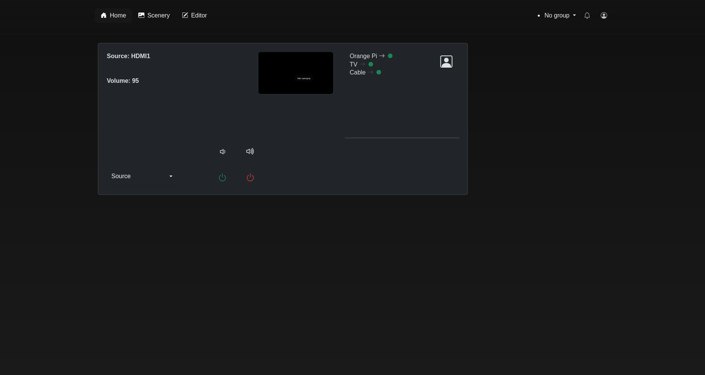
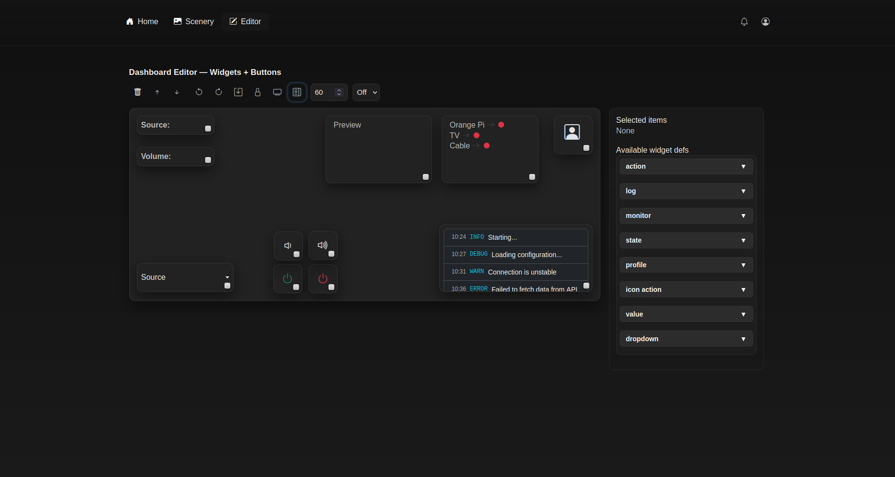
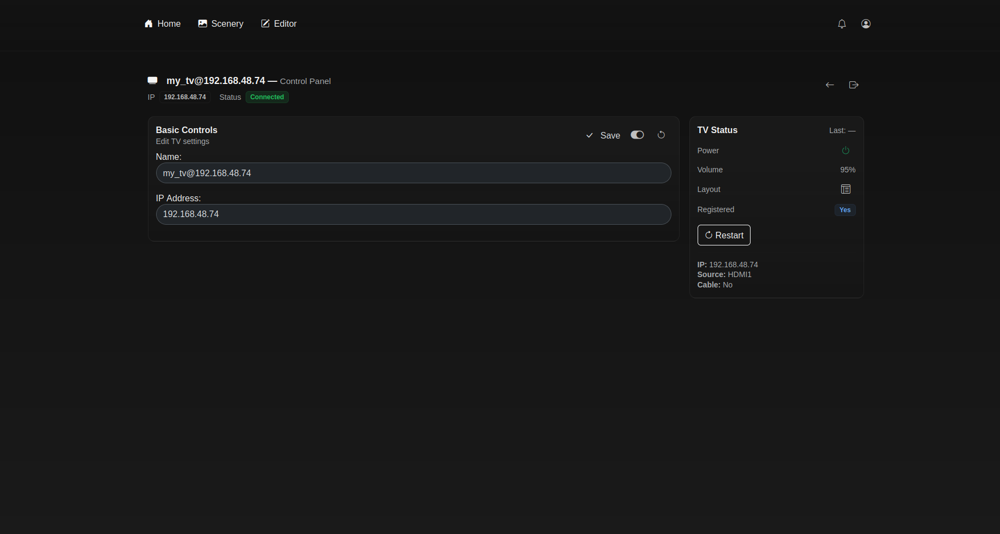
[Демо‑видео (внешняя ссылка)](https://github.com/your-repo-path/TV/video.mp4)

### Casino Administration

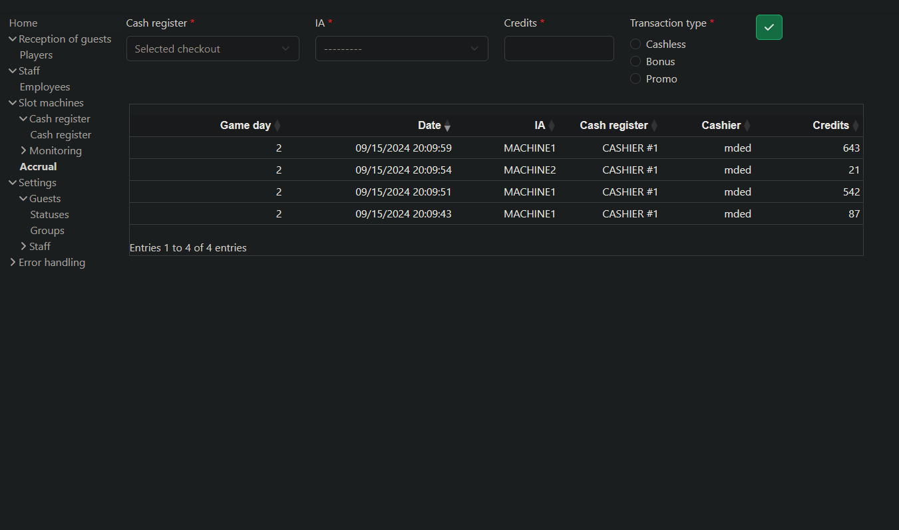
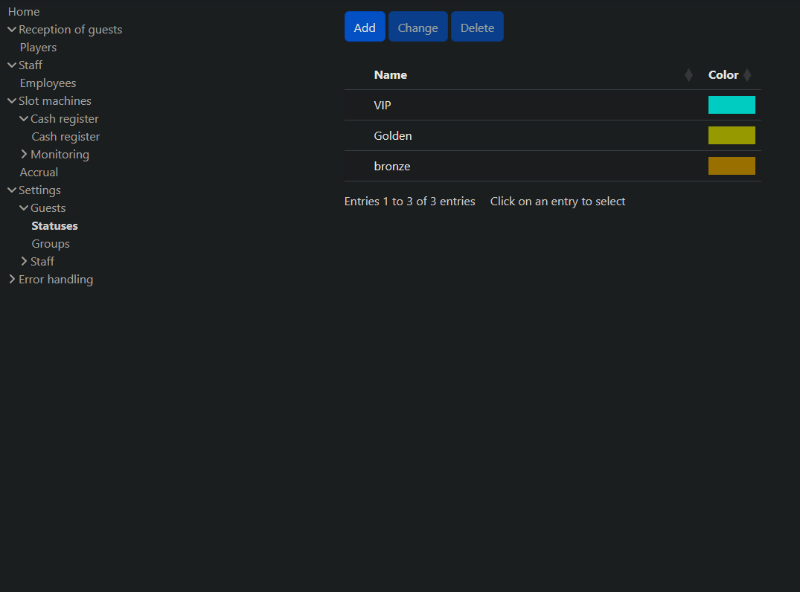
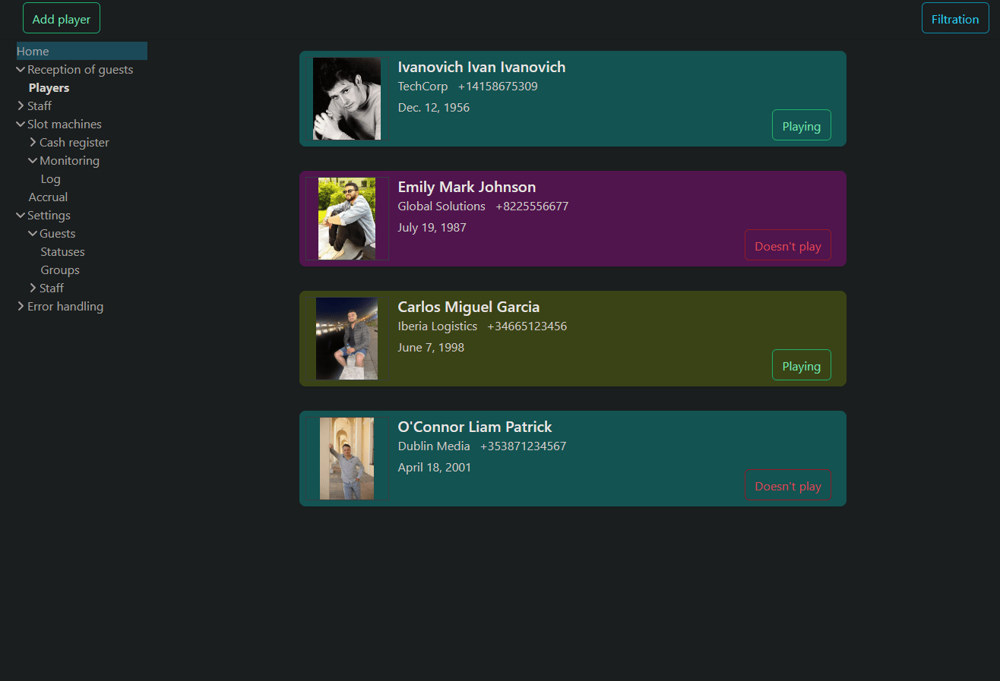
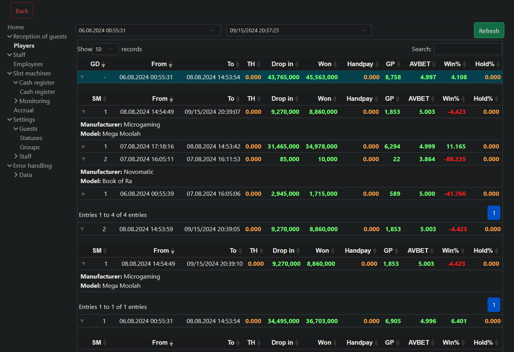
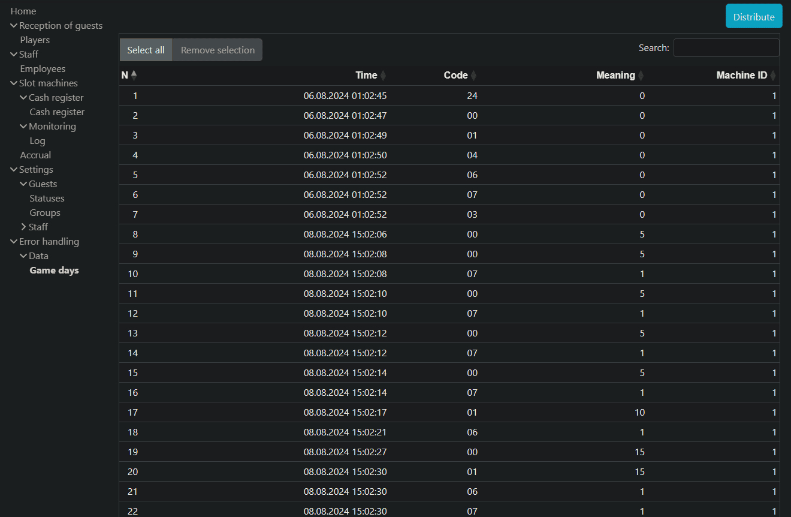

### Old Analyzer

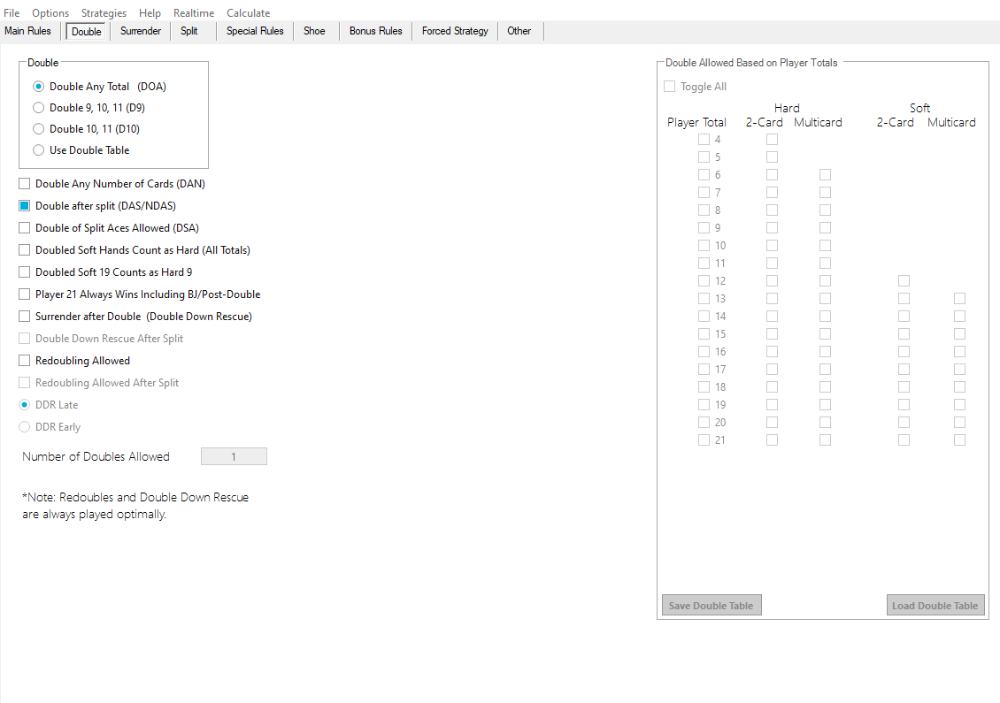
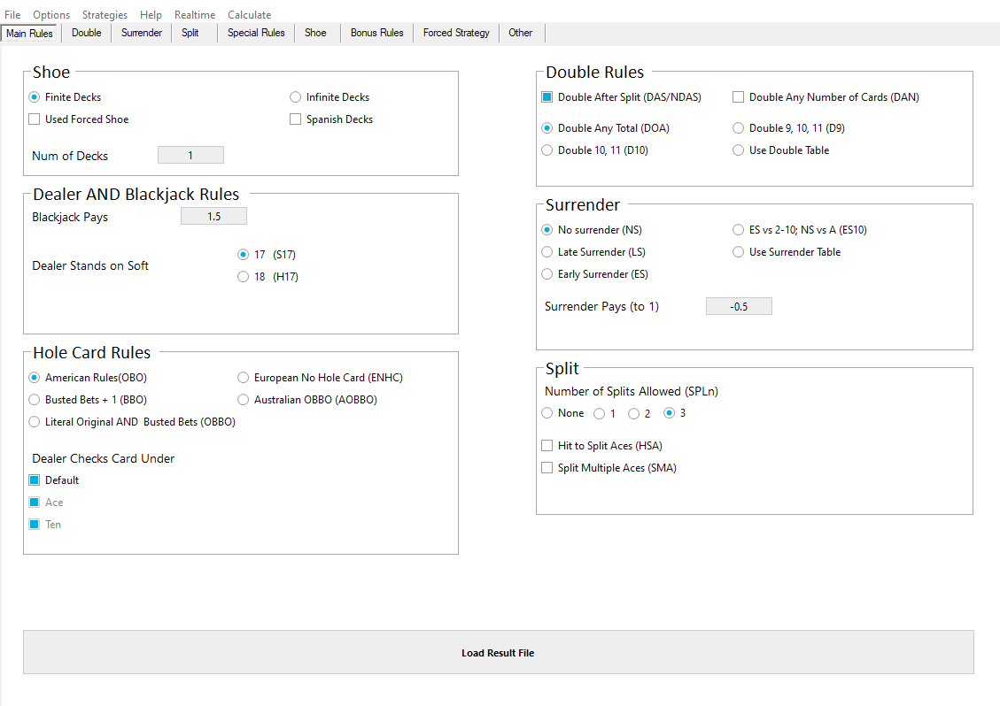

### SAS Communication Module (публичный)

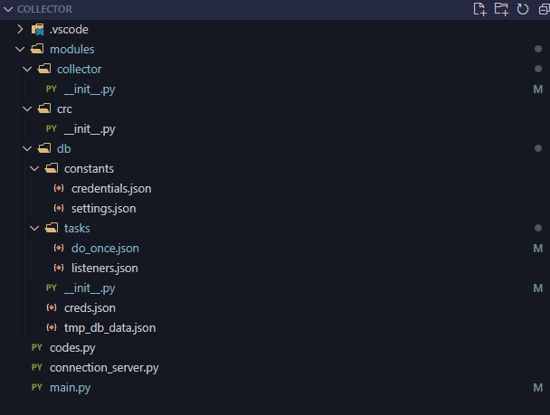
[Демо‑видео](./sascomm/video.mp4)

### Скрапер судов

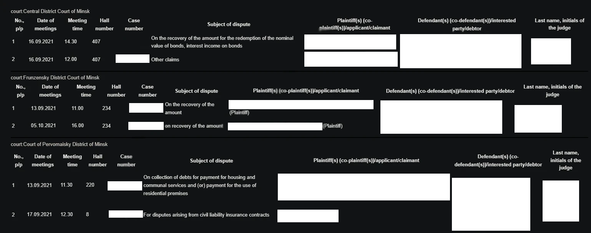

---

## 🔐 Политика публичного / приватного

* **Публично:** модуль SAS, санитизированные примеры, диаграммы архитектуры, демо‑видео и скриншоты там, где не раскрываются клиентские данные.
* **Приватно:** исходный код клиентских проектов, проприетарные коннекторы и конфигурации клиентов (по NDA).

---
